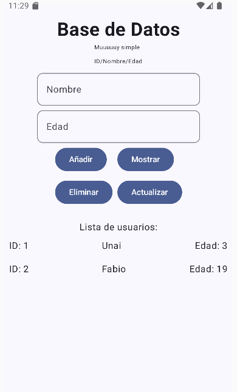

# **Gestor de Usuarios** 👥

Esta aplicación permite gestionar una base de datos de usuarios, donde se pueden agregar, eliminar, mostrar y actualizar los datos de los usuarios, incluyendo su nombre y edad. Está diseñada para ser fácil de usar y eficiente en la gestión de información personal. 🛠️

## **Características** 📝

- **Agregar usuarios** ➕: Permite agregar nuevos usuarios a la base de datos con su nombre y edad.
- **Eliminar usuarios** ❌: Puedes eliminar usuarios existentes de la base de datos.
- **Mostrar usuarios** 👀: Muestra todos los usuarios registrados junto con su edad.
- **Actualizar usuarios** ✏️: Permite modificar la información de un usuario (nombre o edad).

## **Capturas** 📸

